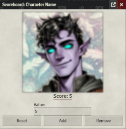

# CUSTOM: HotM Scoreboard

[[_TOC_]]

## Overview

A Foundry vtt module designed to support Character sheet tracking of a generic score.

## Example

> Below the portrait you should see the addition of the Scoreboard, clicking the `Score` will post that to the active chat.

> Adjusting the score will bring up a seperate menu that will enable the adjustment of the score, including resetting this score back to zero.

## Future Plans

- Implement a control menu to support custom Admin actions.
